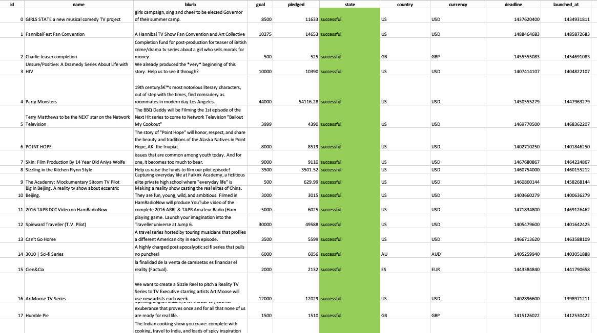
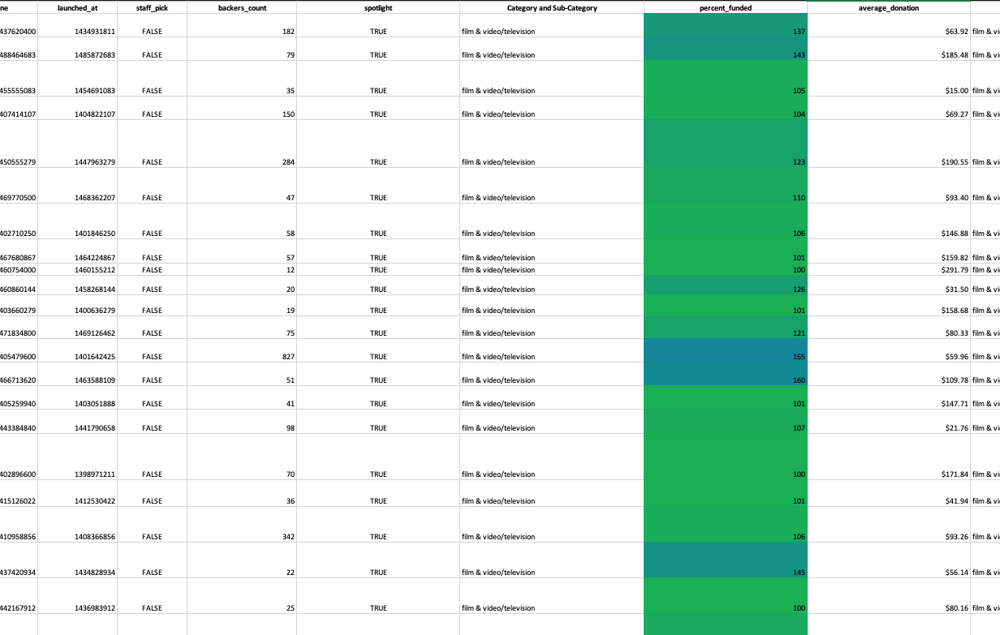

# Excel-Challenge: Kickstart My Chart

## Background

Over $2 billion has been raised using the massively successful crowdfunding service, Kickstarter, but not every project has found success. Of the more than 300,000 projects launched on Kickstarter, only a third have made it through the funding process with a positive outcome.

Getting funded on Kickstarter requires meeting or exceeding the project's initial goal, so many organizations spend months looking through past projects in an attempt to discover some trick for finding success. For this week's homework, you will organize and analyze a database of 4,000 past projects in order to uncover any hidden trends.

## Overview

This project generates insights about the Kickstart My Chart dataset and defines the outcomes by using tables, graphs, and statistical summaries.
[Final Workbook](./excel-challenge.xlsx)

## Solution 

* The conditional formatting is conducted to fill in each cell in the "state" and "Percent Funded" column with different color, depending on whether the associated campaign was successful, failed, or canceled, or is currently live. The "Percent Funded" also is newly created to uncover how much money a campaign made to reach its initial goal.

 

  * Another column P called "Average Donation" was created that uses a formula to uncover how much each backer for the project paid on average.

  * Two new columns, one called "Category" at Q and another called "Sub-Category" at R, which uses formulas to split the "Category and Sub-Category" column into two-part were created. 

  *  A pivotal table was analyzed and implemented to see the initial worksheet to count how many campaigns were successful, failed, canceled, or are currently live per **category**. In addition to that, a stacked column pivot chart that can be filtered by country based on the table has been created.

 

  * A new sheet with a pivot table was created and analyzed the initial sheet to count how many campaigns were successful, failed, or canceled, or are currently live per **sub-category**. In addition to that, a stacked column pivot chart was created that can be filtered by country and parent-category.

* The format of dates stored within the "deadline" and "launched_at" columns was converted from Unix timestamps format into Excel's date format in to and new columns named "Date Created Conversion" and "Date Ended Conversion" were created respectively.

 

  * A new sheet with a pivot table was created with a column of "state", rows of new sheet with a pivot table were created with a column of "state", rows of "Date Created Conversion", values based on the count of "state", and filtered based on "parent category" and "Years". Subsequently, a pivot chart line graph that visualizes this new table was created. "Date Created Conversion", values based on the count of "state", and filtered based on "parent category" and "Years". Subsequently, a pivot chart line graph that visualizes this new table was created.

Look for the final report  [Report](./Report.doc)
## Bonus

* Create a new sheet with 8 columns:

  * `Goal`
  * `Number Successful`
  * `Number Failed`
  * `Number Canceled`
  * `Total Projects`
  * `Percentage Successful`
  * `Percentage Failed`
  * `Percentage Canceled`

* In the `Goal` column, create 12 rows with the following headers:

  * Less than 1000
  * 1000 to 4999
  * 5000 to 9999
  * 10000 to 14999
  * 15000 to 19999
  * 20000 to 24999
  * 25000 to 29999
  * 30000 to 34999
  * 35000 to 39999
  * 40000 to 44999
  * 45000 to 49999
  * Greater than or equal to 50000

  

* Using the `COUNTIFS()` formula, count how many successful, failed, and canceled projects were created with goals within the ranges listed above. Populate the `Number Successful`, `Number Failed`, and `Number Canceled` columns with this data.

* Add up each of the values in the `Number Successful`, `Number Failed`, and `Number Canceled` columns to populate the `Total Projects` column. Then, using a mathematical formula, find the percentage of projects that were successful, failed, or canceled per goal range.

* Create a line chart that graphs the relationship between a goal's amount and its chances at success, failure, or cancellation.

## Bonus Statistical Analysis

If one were to describe a successful crowdfunding campaign, most people would use the number of campaign backers as a metric of success. One of the most efficient ways that data scientists characterize a quantitative metric, such as the number of campaign backers, is by creating a summary statistics table.

For those looking for an additional challenge, you will evaluate the number of backers of successful and unsuccessful campaigns by creating **your own** summary statistics table.

* Create a new worksheet in your workbook, and create a column each for the number of backers of successful campaigns and unsuccessful campaigns.

  

* Use Excel to evaluate the following for successful campaigns, and then for unsuccessful campaigns:

  * The mean number of backers.

  * The median number of backers.

  * The minimum number of backers.

  * The maximum number of backers.

  * The variance of the number of backers.

  * The standard deviation of the number of backers.

* Use your data to determine whether the mean or the median summarizes the data more meaningfully.

* Use your data to determine if there is more variability with successful or unsuccessful campaigns. Does this make sense? Why or why not?

## Submission

* To submit your homework, upload the solution and files to a GitHub repo, Dropbox, or Google Drive and submit the link to <https://bootcampspot.com/>.

- - -

© 2019 Trilogy Education Services
