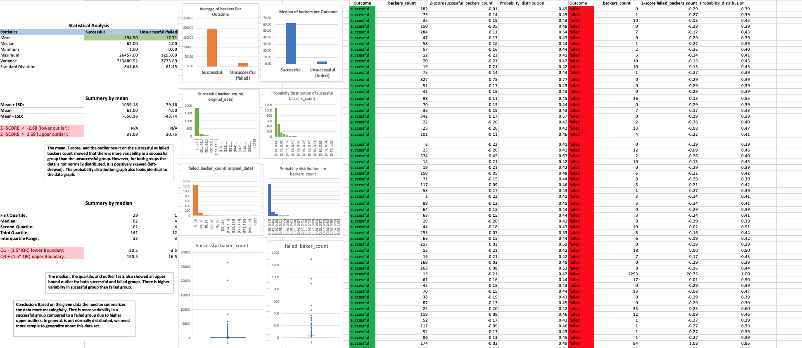

# Excel-Challenge: Kickstart My Chart

## Background

Over $2 billion has been raised using the massively successful crowdfunding service, Kickstarter, but not every project has found success. Of the more than 300,000 projects launched on Kickstarter, only a third have made it through the funding process with a positive outcome.

Getting funded on Kickstarter requires meeting or exceeding the project's initial goal, so many organizations spend months looking through past projects in an attempt to discover some trick for finding success. For this project organize and analyze a database of 4,000 past projects in order to uncover any hidden trends.

This project generates insights about the Kickstart My Chart dataset and defines the outcomes by using tables, graphs, and statistical summaries.
[Final Workbook](./excel-challenge.xlsx)

## Solution 

* Conditional formatting was implimented to fill in each cell in the "state" and "Percent Funded" column with different color, depending on whether the associated campaign was successful, failed, or canceled, or is currently live. The "Percent Funded" also is newly created to uncover how much money a campaign made to reach its initial goal.

* Another column P called "Average Donation" was created that uses a formula to uncover how much each backer for the project paid on average.

* Two new columns, one called "Category" at Q and another called "Sub-Category" at R, which uses formulas to split the "Category and Sub-Category" column into two-part was created. 

*  A pivotal table was analyzed, and implemented to see the initial worksheet to count how many campaigns were successful, failed, canceled, or are currently live per **category**. In addition to that, a stacked column pivot chart that can be filtered by country based on the table has been created.

* A new sheet with a pivot table was created and analyzed the initial sheet to count how many campaigns were successful, failed, or canceled, or are currently live per **sub-category**. In addition to that, a stacked column pivot chart was created that can be filtered by country and parent-category.

* The format of dates stored within the "deadline" and "launched_at" columns was converted from Unix timestamps format into Excel's date format and new columns named "Date Created Conversion" and "Date Ended Conversion" was created respectively.

* A new sheet with a pivot table was created with a column of "state",rows of "Date Created Conversion", values based on the count of "state", and filtered based on "parent category" and "Years". Subsequently, a pivot chart line graph that visualizes this new table was created. "Date Created Conversion", values based on the count of "state", and filtered based on "parent category" and "Years". Subsequently, a pivot chart line graph that visualizes this new table was created.

Look for the final report  [Report](./Report.doc)

## Bonus
* A new worksheet was created to compare the count of successful, failed, and canceled campaign outcomes across the goal. For this task, a "COUNTIF()" formula was used to accomplish the task. To visualize the effect a line graph was created and displayed. 

## Bonus Statistical Analysis

* Statistical analysis was implemented and visualized to compare how successful, and failed campaign outcomes varied across the number of backers count. Mean, median, minimum, maximum, variance, the standard deviation was calculated. At last, the outlier test is conducted to determine whether the mean or median summarizes the data meaningfully. 

# Conclusion 

## Conclusion 1

The Kickstarter campaign has shown a higher frequency in the theater category compared to other groups.In the data next to theater music, film and video is most prevalent. These may be due to theater is the best-suited place to get a lot of people at once and conduct a campaign.

## Conclusion 2

In general, the Kickstarter campaign has greater success than failed, canceled, or live. However, the sample size is yet limited to generalize. When we come to successful campaign, music is the top. The percentage of successful music campaigns from the total is higher than the other groups. Music has a 77 % success rate followed by theater, which has a 60% success rate. Music also has a lower failed and canceled value.

## Conclusion 3 

The time serious analysis of Kickstarter campaign has shown successful result on May, however if we filter theater from the category February is the peak. This may due to summer is on the way people start to go out for entertainment or theater. In the other category the binging’s of the year are the peak it may be due to a new year resolution started to be implemented.

## Conclusion 4
The mean, Z-score, and the outlier result on the successful vs failed backers count showed that there is more variability in a successful group than the unsuccessful group. However, for both groups the data is not normally distributed, it is positively skewed (left-skewed). The probability distribution graph also looks identical to the data graph. 

The median, the quartile, and outlier tests also showed an upper bound outlier for both successful and failed groups. There is higher variability in a successful group than the failed group. Based on the given data the median summarizes the data more meaningfully. 

## Limitations of the dataset

* This dataset only includes a third of the population from more than 300,000 projects. To have a better insight, we need more samples.
* The data sourced from multiple countries, and their currency, in this case, I don't get how the data normalized those currencies into one and compared the outcome.
* The data is not normally distributed we need more samples to generalize about the data set.
* The dataset has outliers.  For example, the outlier testing of the percent funded column has upper bound outliers. In addition to that backers count for both successful and failed campaign outcome showed upper-bound outlier. 

## Possible tables and/or graphs that we could create
* Make outlier testing 
* Creating a table and graph by excluding outliers  
* Creating a graph that shows the campaign result quarterly, and yearly
* Conducting some statistical analysis, creating a table and graph that shows the difference in campaign outcomes across categories and time
* Creating a graph and table by making a comparison across different countries on the campaign being successful or failed.
* Creating a comparison table or graph which shows average donation across campaign outcome  

- - -
© 2019 Trilogy Education Services
